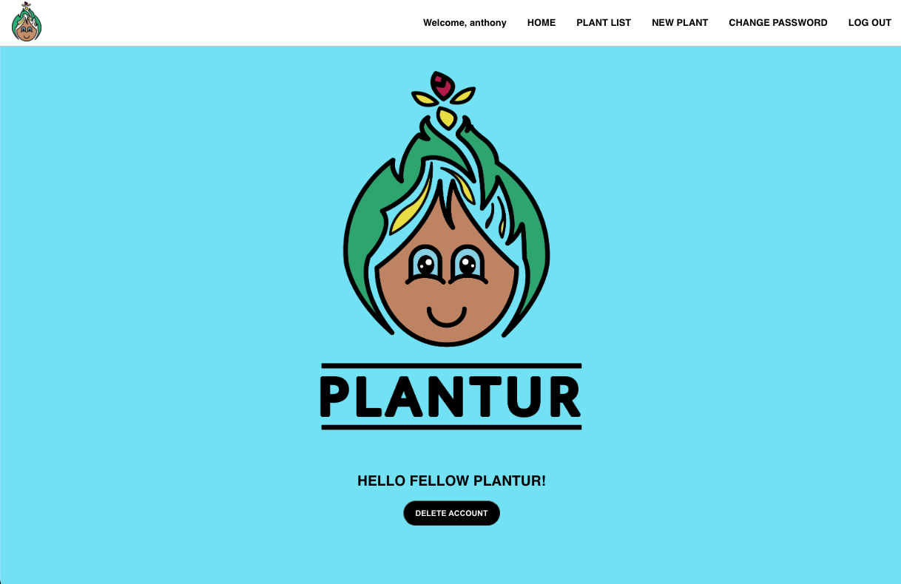

# Plantur App!

The "PLANTUR" was created with any plant or plant/wannabe plant lover in mind. To help keep track of all thier plants, thier names, how much light they need and how much water they need. 

# [VIEW APP SITE HERE!](https://plantur.netlify.app/) 💾

## Technologies Used 👨‍💻

- CSS
- JavaScript
- HTML
- GitHub
- Fly.io
- photoshop
- Express
- PostgreSQL
- Sequelize
- Netlify

## Credits & Attributions 🙏

I am very proud of this design because everything was created by me!

## Recent Changes 👏

- Rework the icon placement for a more clean look on the home page.
- Delete redundant css.
- Optimize display: flex; for overall layout and responsiveness.
- Delete redundant javascript.

## Ice Box 🍧

- [ ] Add categories for when to water plants
- [ ] Add a reminder for when to water plants
- [ ] Include a plant API to pull plant information for you
- [ ] Dark Mode
